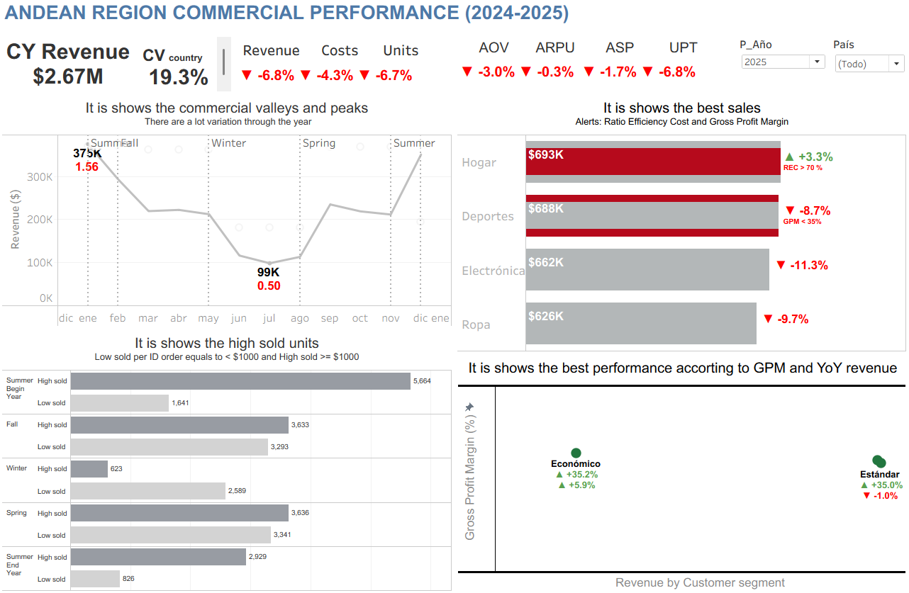
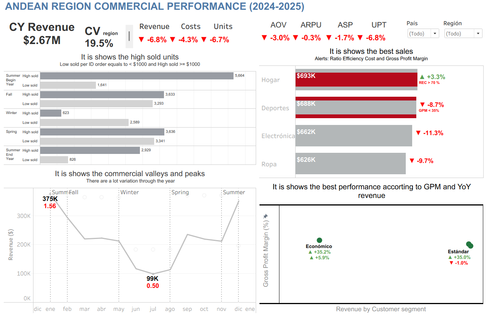
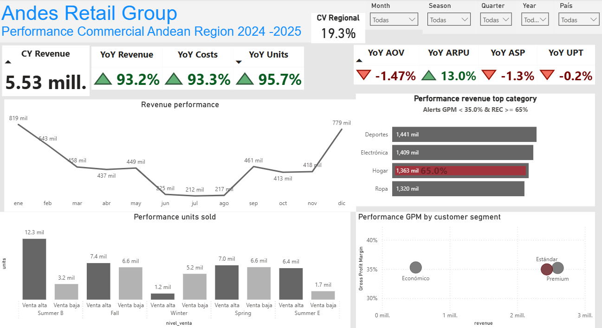
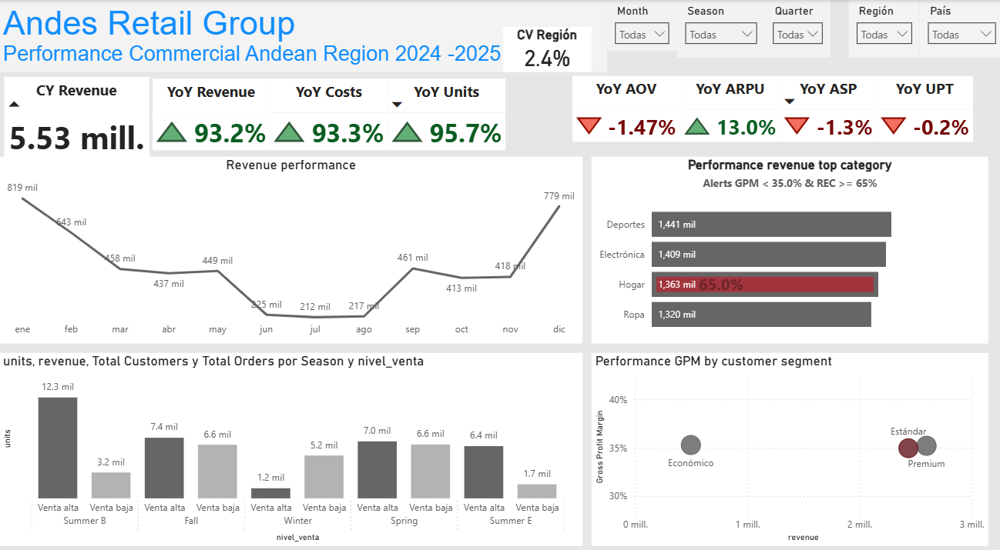

# Andes Retail Group — Commercial Performance & Strategic Optimization (2024–2025)
> Executive commercial performance dashboard for a multi-country retail operation in the Andean region (Chile, Peru, and Colombia), built in Tableau and replicated in Power BI as an Analytics Engineering exercise.

---

## Executive Summary

Andes Retail Group is a retail company operating in **Peru, Chile, and Colombia**, selling products across four categories: Electronics, Apparel, Sports, and Home. Executive leadership needed an interactive dashboard to understand commercial performance for 2024–2025, since data was scattered across raw transactional records with no consolidated view to answer strategic questions about sales, profitability, and customer behavior.

This project transforms that transactional dataset into a system of KPIs, SCQA storytelling, and executive visualizations that identify profitability leaks, regional concentration risk, and cyclical commercial valleys — without requiring anyone to read a single row of Excel.

**Headline finding:** the period showed a **12.1% contraction in revenue** and **11.4% in units sold**, critically concentrated in **Peru's Central Region** (-19%).

---

## Business Problem

**Current situation:** sales, cost, and customer data live in flat transactional records, with no analytical structure or consolidated view.

**Problem:** there is no mechanism to quickly and reliably answer strategic questions about revenue evolution, segment profitability, product category impact, geographic differences, seasonal patterns, and commercial improvement opportunities.

**Business impact:** without this visibility, executive leadership cannot prioritize where to intervene (which country, which category, which customer segment) nor anticipate demand valleys for supply chain planning.

---

## Project Objectives

### General Objective
Build an executive dashboard that translates Andes Retail Group's transactional behavior into clear, actionable visual information for commercial decision-making.

### Specific Objectives
- Connect, validate, and prepare the 2024–2025 transactional dataset for analysis.
- Design two views (Overview and Detail) applying visual hierarchy and cognitive load reduction principles.
- Build KPIs and advanced indicators (YoY, AOV, ARPU, ASP, UPT, Coefficient of Variation, Seasonality Index) that answer concrete business questions.
- Implement filters and interactions enabling dynamic exploration by year, country, and region.
- Build a strategic narrative using the **SCQA** model and a Slack-style executive message.

---

## Dataset

| Attribute | Description |
|---|---|
| Source | Andes Retail Group internal transactional data |
| Records | Individual orders (1 row = 1 order) |
| Time Period | 2024 – 2025 |
| Granularity | Transactional (order level) |
| Geography | Peru, Chile, Colombia (Region: North / Central / South) |
| Categories | Electronics, Apparel, Sports, Home |

| Column | Data Type | Description |
|---|---|---|
| `ID_Pedido` | Integer | Unique order identifier |
| `Fecha_Pedido` | Date | Date the sale was made |
| `Estación` | Categorical | Southern Hemisphere season (Summer, Fall, Winter, Spring) |
| `ID_Cliente` | Categorical | Unique customer identifier |
| `Segmento_Cliente` | Categorical | Customer type by commercial value (Economic, Standard, Premium) |
| `Región` | Categorical | Geographic region within the country (North, Central, South) |
| `País` | Categorical | Country where the sale occurred |
| `Categoría_Producto` | Categorical | Product type sold |
| `Unidades_Vendidas` | Integer | Number of units sold |
| `Precio_Unitario` | Decimal | Unit price |
| `Ingresos` | Decimal | Total revenue (price × units) |
| `Costo` | Decimal | Cost associated with the sale |

> Column names are kept in their original Spanish form to match the source dataset exactly, ensuring direct traceability between this documentation and the workbook fields.

---

## Tech Stack
- **Visualization:** Tableau Public, Power BI Desktop
- **Data preparation:** Power Query (M Language), Tableau Data Prep
- **Analytical computation:** Tableau Calculated Fields / LOD Expressions, Power BI DAX
- **Conceptual development:** Jupyter Notebook (Python)
- **Version control:** Git, GitHub

---

## Repository Structure
```text
andes-retail-commercial-performance/
│
├── data/
│   └── raw/
│       └── Andes_Retail_Group_2024_2025.xlsx
│
├── notebooks/
│   └── 01_business_analysis_and_dashboard_design.ipynb
│
├── dashboards/
│   ├── tableau/
│   │   └── commercial_performance_dashboard.twb
│   │
│   └── power-bi/
│       └── commercial_performance_dashboard.pbix
│
├── images/
│   ├── thumbnail.png
│   ├── tableau_overview.png
│   ├── tableau_detail.png
│   ├── power_bi_overview.png
│   └── power_bi_detail.png
│
├── README.md
└── .gitignore
```

> This repository does not include a `LICENSE` file or `requirements.txt`. The licensing decision is declared as a note in this README (see *Usage Notice*), and the notebook was used solely as a conceptual development space in Jupyter, with no dependencies to pin in a requirements file.

---

## Project Workflow
```text
Business Understanding → Data Understanding → Data Preparation
→ Analysis → Dashboard Development → Business Insights → Recommendations
```

| Step | Action | Business Outcome |
|---|---|---|
| 1. Connection and exploration | Import the dataset, review data types and key columns | Initial understanding of the business |
| 2. Data preparation | Validate types, create `Nivel_Venta`, normalize dates and seasonality | Clean dataset ready for analysis |
| 3. Design and planning | Define questions per view, KPIs, and visual hierarchy | Clear, professional dashboard plan |
| 4. Visualizations | Build the Overview View and the Detail View | Executive vision + in-depth analysis |
| 5. Filters and interactions | Year, country, and region as cross-filters | Dynamic business exploration |
| 6. SCQA narrative | Build the dashboard story and executive message | Clear, actionable strategic insight |

---

## Data Preparation

- Converted `Fecha_Pedido` to Latin American Spanish date format.
- Corrected data types on numeric columns (`Ingresos`, `Costo`, `Unidades_Vendidas`, `Precio_Unitario`).
- Created a conditional column `Nivel_Venta`:
  - `Ingresos >= 1000` → **"High Sale"**
  - Otherwise → **"Low Sale"**
- **Seasonality mapping:** the `Estación` field follows a fixed Southern Hemisphere calendar applied uniformly to Chile, Peru, and Colombia: Summer (Jan, Feb), Fall (Mar, Apr, May), Winter (Jun, Jul, Aug), Spring (Sep, Oct, Nov), and Summer (Dec). December is mapped back to Summer rather than starting a new "Winter" block, since the season spans the calendar year-end and must read as one continuous period when ordered chronologically.
- Quality validation through Column Profile / Column Quality checks before starting the modeling phase.

---

## Data Modeling (Power BI replication)

As an Analytics Engineering exercise, the project was replicated in Power BI with a single fact table plus one independent date dimension:

- **andes_retail_group_2024_2025** — the transactional fact table, containing Revenue, Cost, Units, along with geography, product, and customer attributes embedded directly in the same table (no separate `Dim_Geografía`, `Dim_Productos`, or `Dim_Clientes` were created for this iteration).
- **Dim_Calendario** — the only dedicated dimension table built for this model: an independent date table (Power BI's automatic date hierarchy was deliberately not used), with `Year`, `Month`, `Quarter` columns and a **Season** column chronologically ordered via `Sort by Column`.

This is a simplified, single-fact-table model rather than a full Star Schema. It was sufficient for this project's scope, but a future iteration would split geography, product, and customer attributes into their own dimension tables to reduce redundancy and improve filter performance as the dataset grows.

This architecture enabled the implementation of Time Intelligence functions (`TOTALYTD`, `SAMEPERIODLASTYEAR`) and level-of-detail expressions (LOD in Tableau / `CALCULATE` + `ALL` in DAX) to build year-over-year comparable metrics without the sheet's filters "destroying" the historical context.

---

## KPIs & Business Metrics

| Indicator | Acronym | What it answers |
|---|---|---|
| Year-over-Year Growth | YoY | Is the business growing or contracting versus last year? |
| Average Order Value | AOV | Average revenue per order |
| Average Revenue Per User | ARPU | Average value generated per unique customer |
| Average Selling Price | ASP | Average selling price per unit |
| Units Per Transaction | UPT | Average units per order |
| Gross Margin | GM | Direct profitability after deducting costs |
| Cost Efficiency Ratio | REC | How many cents it costs to capture each dollar of revenue |
| Coefficient of Variation | CV | Level of dependency/inequality across regions or countries |
| Seasonality Index | SI | Strength of a season relative to the historical average (commercial peaks and valleys) |

> **CV** and **SI** are calculated over the full historical period (2024–2025) rather than the current year, to prevent a single year's anomaly from distorting the read on structural risk or true business seasonality.

---

## Dashboard Structure

### 🖥️ Overview View (Executive)
**Question it answers:** How is the business doing overall?

- KPIs: Total Revenue (YoY), Coefficient of Variation by country, YoY of revenue/costs/units, YoY of AOV/ARPU/ASP/UPT.
- Line chart: revenue evolution over time, with min/max markers and a Seasonality Index alert.
- Horizontal bar chart: revenue and YoY by product category, with visual alerts for Cost Efficiency Ratio (>65%) and Profit Margin (<35%).
- Scatter plot: revenue vs. YoY revenue vs. profit margin, segmented by customer type.
- Filters: Year, Country.

### 🔎 Detail View (Analysis)
**Question it answers:** Where are the differences, patterns, or opportunities?

- Breakdown by Region within each country.
- Seasonal comparison against units sold and `Nivel_Venta` to detect commercial valleys.
- Geographic performance table with conditional formatting.
- Filters: Country, Region.

---

## Business Storytelling (SCQA Model)

**S (Situation):** the overall direction of the business is observed, both globally and by country.

**C (Complication):** the business contracted **12.1% in revenue** and **11.4% in units sold**, alongside an 11.1% reduction in operating costs — a signal of structural slowdown rather than efficiency improvement.

**Q (Question):** were there commercial valleys or regions with concentrated low demand?

**A (Answer):** Peru was the country with the largest contraction (**-10%** in revenue and units). Within Peru, the **Central Region** is the critical point, with a **19%** drop in revenue and units.

### 📊 Executive Message (Slack style)

> **Commercial performance update**
>
> In the 2024–2025 commercial performance review, we observed a 12.1% contraction in revenue and 11.4% in units sold.
>
> At a deeper level, Peru showed an overall contraction of 10% in revenue and units.
>
> In Peru's Central Region, the contraction reached 19% in revenue and units.
>
> We recommend reviewing whether the campaigns and promotions applied in that region were ineffective.

---

## Key Insights

1. **Regional concentration risk:** the Coefficient of Variation detected that the operation depends unevenly on certain regions, opening a window for commercial optimization in underdeveloped zones.
2. **Operational efficiency by category:** visual alerts on Cost Efficiency Ratio (>65%) and Profit Margin (<35%) help prioritize "star" categories over categories that drive volume but erode margin.
3. **Calendar-aware seasonality:** splitting Summer into a Jan–Feb block and a separate December block preserves chronological order across the year-end boundary, preventing December sales from being misread as the start of a new season when analyzing month-over-month trends.

## Business Recommendations

- Audit the campaigns and promotions applied in Peru's Central Region during the period of greatest decline.
- Reallocate commercial budget toward regions with a lower relative Coefficient of Variation to reduce single-market dependency.
- Review the cost structure in categories with a Cost Efficiency Ratio above 65%.

---

## How to Reproduce

1. Clone the repository.
2. Open `notebooks/01_business_analysis_and_dashboard_design.ipynb` to review the conceptual development and dashboard design.
3. Load the dataset from `data/raw/Andes_Retail_Group_2024_2025.xlsx`.
4. Open `dashboards/tableau/commercial_performance_dashboard.twb` **or** `dashboards/power-bi/commercial_performance_dashboard.pbix`.
5. Refresh the data source if needed and reload the model.

---

## Dashboard Preview

### Tableau



### Power BI



---

## Live Dashboard

🔗 **Tableau Public:** [Andes Retail Group — Commercial Performance Dashboard](https://public.tableau.com/app/profile/jacobo.galindo.ortiz/viz/Andes_Retail_Group_2024_2025/Porpas?publish=yes)

> The Power BI dashboard is included in this repository as a technical replication exercise (single fact table + Dim_Calendario, DAX, and Time Intelligence) and is not published as a standalone deliverable, since the project calls for a single final dashboard.

---

## Future Improvements
- Connect filters across tabs and seasonal charts for cross-filtering.
- Incorporate demand forecasting based on the historical Seasonality Index.
- Evaluate migrating the Power BI model to an automated pipeline with optimized Power Query (early row filtering before text transformations).

## Lessons Learned
- **Technical:** the difference between row-level filters and level-of-detail expressions (LOD / `CALCULATE` + `ALL`) is critical for building comparative metrics (YoY, CV, SI) that don't break when the filter context changes.
- **Business:** the same calendar logic can be misread as a data quality issue if it isn't documented — splitting Summer across the year-end boundary is a deliberate modeling choice, not an inconsistency, and it needs to be explained clearly so a reviewer doesn't mistake it for an error.
- **Professional:** cross-validating results across tools (Excel, Tableau, Power BI) before presenting a KPI to leadership is a quality-control practice, not an optional step.

---

## Author
**Jacobo Galindo Ortiz**
Data Analyst Portfolio
[LinkedIn](#) · [GitHub](#)

## Usage Notice

This repository is provided for portfolio and educational review purposes.

The project may be viewed to evaluate the analytical approach, methodology, and implementation. It is not intended for redistribution, commercial use, or incorporation into other projects without prior written permission from the author.

If you would like to reference or discuss any part of this work, please contact the author.
